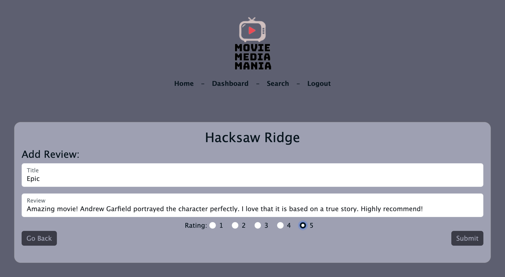

# :clapper: Social-Movie-Media
 

## :page_facing_up: Description

- Movie Media Mania is your go to source for searching, learning, reviewing, and sharing information on all your favorite movies!
- This repo showcases a completed front-end and back-end project.

### Motivation
Our motivation for creating this application was in part due to the Oscars this past weekend. Some of us had seen many of the pictures nominated, but we couldn’t remember the list of all the movies we watched. It was also hard to recall details of some of the movies, as we watched them months ago. We were joking about getting on IMDB or Letterboxd to prevent this in the future, and then realized we could fix the problem with our project.

### User Story
- AS A person who likes to watch movies
- I WANT have a social media website for movies where I can search movies and write reviews on them
- SO THAT I can have a place for the movies I have seen and my reviews on these movies.

## Table of Contents

* [Description](#page_facing_up-description)

* [Usage](#wrench-usage)

* [License](#key-license)

* [Features](#confetti_ball-features)

* [Assets](#sparkles-assets)

* [Challenges](#tornado-challenges)

* [Successes](#star2-successes)

* [Future Development](#bulb-future-development)

* [Credit](#medal_military-credit)

## :wrench: Usage

- [Click here](https://mighty-plains-34884.herokuapp.com/) to navigate to the live link of this repository.

-------------------------------------------------------------

- Please see some of the features displayed below:

-------------------------------------------------------------

## :key: License

This project is licensed under the MIT license.

## :confetti_ball: Features
- Use Node.js and Express.js to create a RESTful API.
- Use Handlebars.js as the template engine.
- Use MySQL and the Sequelize ORM for the database.
- Have GET, POST, PUT, DELETE routes for retrieving and adding new data, and editing and deleting existing data.
- Have a folder structure that meets the MVC paradigm.
- Include authentication (express-session and cookies): User Signup/Login/Logout with validations.
- Protect sensitive information with environment variables.
- Custom made Search Engine for an enhanced User Experience
- Deployed using Heroku (with data).
- Movie Dataset
- CSS Framework
- Responsive Webpage
- Interactive Webpage
- Accessible Webpage
- Logo

## :sparkles: Assets

### Technologies Used

- **Dataset:** [Top 100 popular movies from 2003 to 2022 (iMDB)](https://www.kaggle.com/datasets/georgescutelnicu/top-100-popular-movies-from-2003-to-2022-imdb?resource=download)
- **Framework:** [Bootstrap](https://getbootstrap.com/)
- **Applications:** VS Code, Heroku.

### Packages
- [Express](https://www.npmjs.com/package/express) Package
- [Express Handlebars](https://www.npmjs.com/package/express-handlebars) Package
- [express-session](https://www.npmjs.com/package/express-session) Package
- [connect-session-sequelize](https://www.npmjs.com/package/connect-session-sequelize) Package
- [MySQL2](https://www.npmjs.com/package/mysql2) Package
- [Sequelize](https://www.npmjs.com/package/sequelize) Package
- [dotenv](https://www.npmjs.com/package/dotenv) Package
- [bcrypt](https://www.npmjs.com/package/bcrypt) Package

### Resources
- **Logo:** [Free Logo Design](https://www.freelogodesign.org/) / [Remove bg](https://www.remove.bg/upload)
- **Movie Posters:** [IMDb](https://www.imdb.com/)
- **Wireframe:** [Figma](https://www.figma.com/file/IxDNxumuYMueUuQJjAppuS/Untitled?node-id=0-1)
- **Color Palette:** [Coolors](https://coolors.co/d5cfe1-e1dee9-d4bebe-04151f-5d5f71)

## :tornado: Challenges
- Time constraint
- Inputting previous review values onto the edit review page
- Adding Movie Images
- Updating/Deleting Reviews

## :star2: Successes
- Models functioning well
- User Interface does not have issues
- Having handlebar page display when routed properly
- Allowing for a combination of searches
- Updating/Deleting Reviews

## :bulb: Future Development
- Friends List
- More movies, add TV Shows, etc. (more content)
- Display Average User Rating
- Display trailers/clips as background or when hovering over movie
- Further Polish UI

## :medal_military: Credit
- Bootcamp Instructor and TA.
- Bootcamp Materials.
- Bootcamp Class Video Recordings.

Thank you for visiting! :ribbon:
